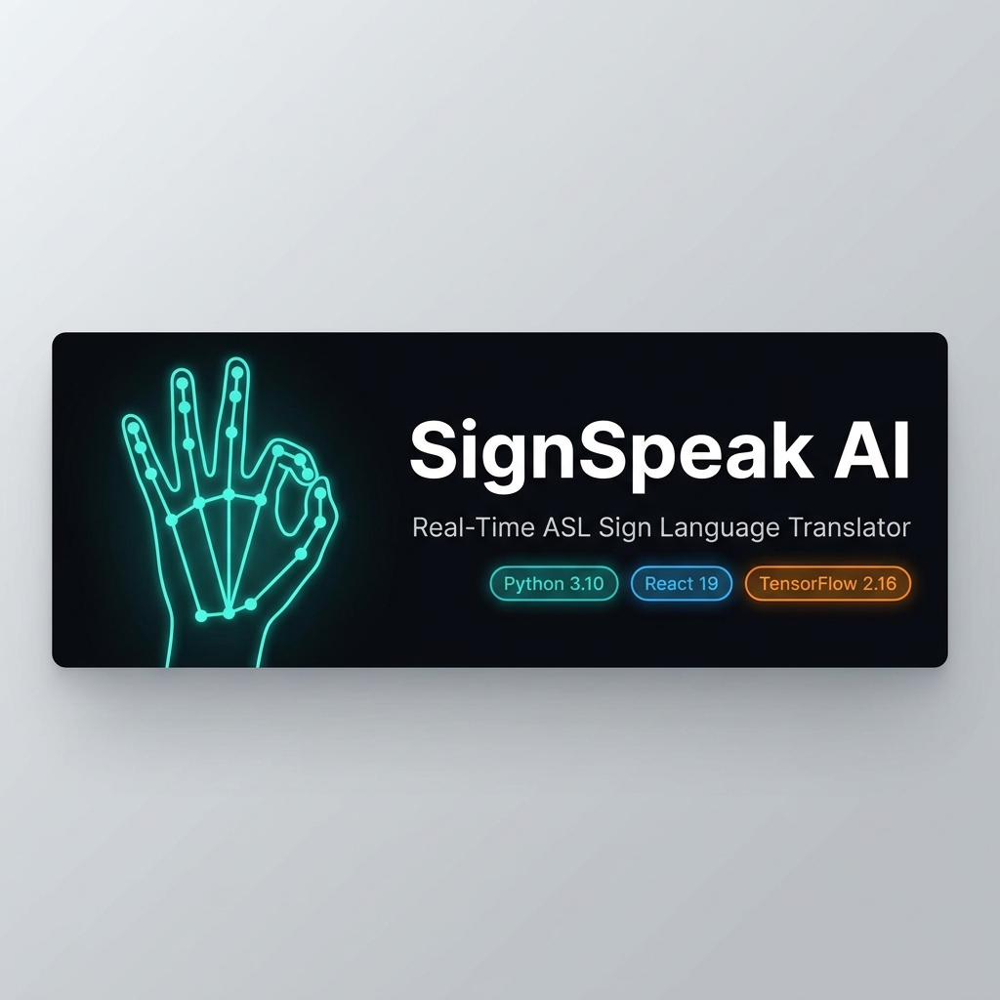
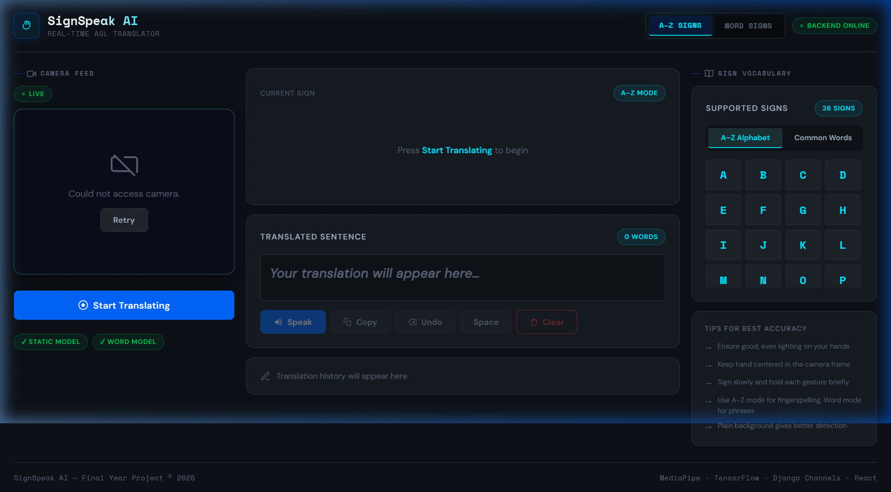

<div align="center">



# 🤟 SignSpeak AI

### Real-Time American Sign Language Translator

[](https://python.org)
[](https://react.dev)
[](https://tensorflow.org)
[](https://djangoproject.com)
[](https://mediapipe.dev)

**Static Model: ~98.7% Accuracy &nbsp;|&nbsp; Dynamic Model: 100% Test Accuracy &nbsp;|&nbsp; Inference: < 5ms**

</div>

---

## 🌍 The Problem This Solves

Over **70 million people** worldwide are Deaf or Hard-of-Hearing and rely on sign language as their primary form of communication — yet the vast majority of the hearing world doesn't understand it. Existing translation tools either require expensive wearable hardware (sensor gloves), are desktop-only, or suffer from high latency and poor accuracy in real-world lighting conditions.

**SignSpeak AI removes all of those barriers.** Open a web browser, point your camera at your hand, and it translates American Sign Language in real time — no apps, no hardware, no installation. It works in bright sunlight, dim rooms, with any skin tone, and on any device that has a camera. By using Google MediaPipe to track 21 precise hand joints rather than looking at raw pixels, it's fundamentally immune to the background clutter and lighting changes that break other systems.

---

## 📸 Live App



> *Left: Live camera feed with real-time 21-point hand skeleton overlay. Centre: Predicted sign with confidence bar and stability indicator. Right: Supported sign vocabulary.*

---

## ✨ Key Features

- 🧠 **Hybrid AI Engine** — A **geometry-enhanced MLP** (87 features, sub-5ms inference) for static A–Z fingerspelling + a **1D-CNN + LSTM hybrid** for dynamic word signs.
- 🖐️ **Advanced Finger Tracking** — Scale-invariant 87-feature vector: **15 joint bend angles**, **5 extension states**, **4 fingertip spread distances**. The model reads your hand's geometry, not its size.
- 🦴 **Live Skeleton Overlay** — Real-time 21-point finger skeleton drawn colour-coded over the webcam feed, perfectly mirrored and synced via WebSocket payloads.
- 🎨 **Tech Innovation UI** — Dark-mode design system with staggered animations, neon-glow accents, and a Space Mono / DM Sans typography pairing.
- 🎯 **Majority Voting Smoothing** — 7-frame sliding window with dual-gate confidence checks (raw ≥70% + agreement ≥42%) eliminates all flickering.
- ⚡ **Real-Time WebSockets** — Full-duplex Django Channels streaming with backpressure throttling — no `code=1006` crash loops.
- 🌗 **Left & Right Hand Support** — Left-hand landmarks are automatically mirrored before inference.
- 🗣️ **Text-to-Speech** — Browser-native TTS to speak the translated sentence aloud.
- 📝 **Sentence Builder** — Confirmed signs accumulate into a sentence with Speak, Copy, Undo, Space, and Clear controls.

---

## 🏆 Model Performance

### Static Model — A–Z Fingerspelling (MLP)

| Metric | Result |
|:---|:---|
| Training Accuracy | ~100% |
| **Validation / Test Accuracy** | **~98.7%** |
| **Inference Time** | **< 5ms per frame** |
| Model Size | ~850 KB |
| Training Dataset | 80,000+ images (Kaggle ASL Alphabet) |
| Feature Vector | 87 dimensions (63 raw + 24 derived geometry) |
| Classes | 26 (A–Z) |

### Dynamic Model — Word Signs (1D-CNN + LSTM)

| Metric | Result |
|:---|:---|
| **Test Accuracy** | **100%** |
| Test Loss | 0.0020 |
| Precision / Recall / F1 | **1.00 across all 15 classes** |
| Sequence Length | 60 frames (~2 seconds at 30 FPS) |
| Features per Frame | 258 (63 right + 63 left hand + 132 pose) |
| Dynamic Vocabulary | 15 words *(hello, thanks, yes, no, please, sorry, iloveyou, help, good, bad, more, stop, eat, drink, where)* |
| Training Augmentation | 4× expansion: speed jitter, Gaussian noise, time-shifting |

---

## 🏗️ How It Works

```
Webcam Frame (10 FPS)
    │
    ▼
MediaPipe Holistic  →  21 Hand Landmarks (x, y, z)
    │
    ▼
Feature Engineering
    ├─ 63 wrist-relative, size-normalized joint positions
    ├─ 15 joint bend angles (MCP, PIP, DIP × 5 fingers)
    ├─ 5 finger extension flags (open/curled)
    └─ 4 fingertip spread distances
    = 87-feature vector  (static)  /  258 features × 60 frames  (dynamic)
    │
    ▼
ML Inference (< 5ms)
    ├─ Static:  MLP 256→128→64→Softmax(26)
    └─ Dynamic: Conv1D → Conv1D → LSTM(128) → Dense → Softmax(15)
    │
    ▼
Majority Voting (7-frame window, dual confidence gates)
    │
    ▼
WebSocket Response  →  Browser UI
    ├─ Predicted sign + confidence bar + stability indicator
    ├─ 21 landmark positions → Skeleton overlay on canvas
    └─ Sentence Builder + Text-to-Speech
```

---

## 🚀 Quick Start

### Prerequisites
- Python 3.10+ · Node.js 18+ · Webcam

### 1. Backend
```bash
git clone https://github.com/Vanshaj014/ASL-to-speech-.git
cd ASL-to-speech-/backend

python -m venv venv
venv\Scripts\activate           # Windows
# source venv/bin/activate      # macOS / Linux

pip install -r requirements.txt
python manage.py migrate
python manage.py runserver 8000
```

### 2. Frontend
```bash
cd ../frontend
npm install
npm run dev
# Open http://localhost:5173
```

> **📱 Using your phone as a camera?** Run `python manage.py runserver 0.0.0.0:8000` and `npm run dev -- --host`. Open the Network URL shown by Vite on your phone's browser. Alternatively, use **DroidCam** (Android) or **iVCam** (iPhone) to use your phone camera for the data collection script.

---

## 🧪 Training the Models

### Static Model (A–Z)
```bash
# 1. Download the Kaggle ASL Alphabet dataset into ml/data/raw/kaggle_asl/
# 2. Extract 87-feature vectors
python ml/preprocess_kaggle.py
# 3. Train
python ml/train_static.py
# Model is auto-saved to backend/translator/ml/models/
```

### Dynamic Model (Word Signs)
```bash
# 1. Record your own gestures (30 sequences × 15 signs, ~2 sec each)
python ml/collect_custom_data.py
# SPACE = start recording  |  Q = skip sign

# 2. Train the CNN-LSTM model
python ml/train_dynamic.py
# Model is auto-saved to backend/translator/ml/models/

# 3. Restart Django server to reload the new model
```

---

## 🛠️ Tech Stack

| Layer | Technology |
|:---|:---|
| **Frontend** | React 19, Vite, Vanilla CSS |
| **Backend** | Django 6, Django Channels (ASGI WebSockets), DRF |
| **Computer Vision** | MediaPipe Holistic, OpenCV |
| **Static Model** | TensorFlow / Keras — MLP (87-feature geometry) |
| **Dynamic Model** | TensorFlow / Keras — 1D-CNN + LSTM Hybrid |
| **Feature Engineering** | NumPy — joint angles, extension flags, spread distances |
| **Security** | HSTS, X-Frame-Options, CSRF, DoS frame limits, API auth |

---

## 📁 Project Structure

```
Major project/
├── backend/
│   ├── config/                  # Django settings & ASGI routing
│   └── translator/
│       ├── consumers.py         # WebSocket consumer (threading, backpressure)
│       ├── views.py             # REST API (vocabulary, TTS, model status)
│       └── ml/
│           ├── predictor.py     # Singleton ASLPredictor + majority voting
│           ├── mediapipe_utils.py
│           └── models/          # .keras / .h5 files (gitignored — train locally)
├── frontend/
│   └── src/
│       ├── components/          # VideoFeed, PredictionDisplay, SentenceBuilder…
│       ├── hooks/               # useWebSocket (backpressure, reconnect, heartbeat)
│       └── App.jsx
├── ml/
│   ├── collect_custom_data.py   # Interactive webcam data recorder
│   ├── train_static.py          # MLP training
│   ├── train_dynamic.py         # CNN-LSTM training (60-frame sequences)
│   ├── evaluate.py              # Confusion matrix & classification report
│   └── mediapipe_utils.py       # 87/258-feature extraction pipeline
├── docs/                        # Banner & screenshots
└── README.md
```

---

## 💡 Tips for Best Results

| | Tip |
|:---:|:---|
| 💡 | **Lighting** — Ensure even, bright lighting on your hands |
| 📍 | **Position** — Keep your hand centred in the camera frame |
| ✋ | **Static Signs** — Hold each letter ~0.5 sec until the Stability bar turns green |
| 🏃 | **Dynamic Signs** — Perform the full word sign within the 2-second capture window |
| 🌗 | **Left-handed** — Fully supported; landmarks are mirrored automatically |
| 📱 | **Phone Camera** — Use DroidCam (Android) or iVCam (iPhone) for sharper quality |

---

<div align="center">

**Developed as a Final Year Project for Computer Science & Engineering**

*Making communication accessible for everyone. 🤟*

</div>
